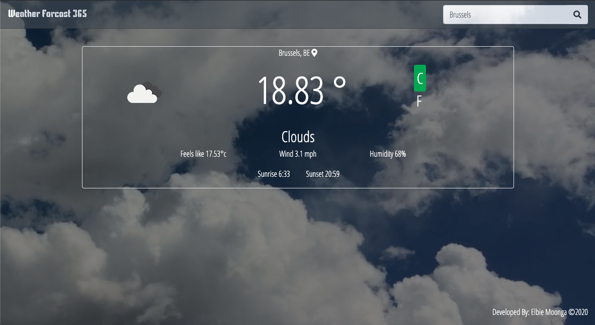

# Weather App with Javascript
Building a weather forecast site using the openweathermap.org web api.

# Live Demo

> Click [here](https://weather365-e1cd5.web.app/) for live demo

# Screenshot



## Built With
- HTML & CSS
- Bootstrap
- JavaScript/ES6
- Fetch Api
- Webpack
- eslint
- style lint

## Usage

- To start the weather application follow the link provided in the live demo section.
- Once the page loads, accept location services for the app to give you the current whether at your location.
- Type any city you desire to view the current weather in that city.

## Requirements

- Compatible Web browser (Chrome, Mozilla, IE, Safari)

## Installation

### Prerequisite

- *Create an Open weather [account]https://home.openweathermap.org/users/sign_up)*
- *Generate an API KEY [API_KEY Generator](https://home.openweathermap.org/api_keys)*

### Steps

From the command line/terminal clone the repository:

```
$ git clone https://github.com/Elbie-em/Weather-App-JS.git
```

Rename .env_sample to .env

```
$ mv .env_sample .env
```

Add you api key here in .env file

```
API_KEY='YOUR_API_KEY_HERE'
```

## Deploy

To deploy on your local environment run:

```
$ npm run start

---> Project will run on http://localhost:8080/public/dist/
```

## Author

👤 **Elbie Moonga**

- GitHub: [@Elbie-Em](https://github.com/Elbie-em)
- Twitter: [ElbieEm](https://twitter.com/ElbieEm)
- LinkedIn: [elbie-moonga](https://www.linkedin.com/in/elbiemoonga/) 

## 🤝 Contributing

Contributions, issues and feature requests are welcome!

Feel free to check the [issues page]().

## Show your support

Give a ⭐️ if you like this project!

## Acknowledgments

- Microverse
- The Odin Project
- Open Weather API

## 📝 License

This project is [MIT](./license.md) licensed.
